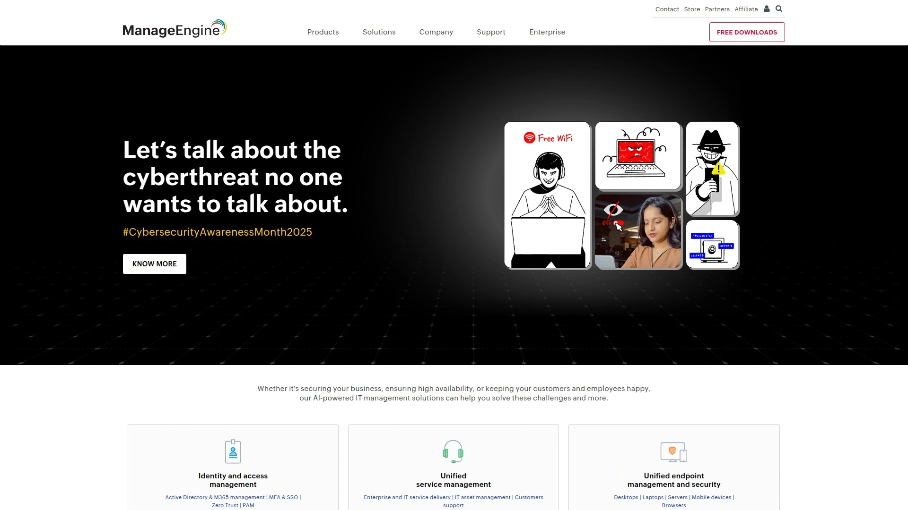

# Top 10 Intune Automation Platforms Ranked in 2025 (Latest Update)

Managing hundreds or thousands of endpoints through Microsoft Intune manually drains IT resources fast. Every policy deployment, compliance check, and device configuration eats hours that could go toward strategic projects instead of repetitive clicking. The right automation platform transforms Intune from a capable but labor-intensive tool into a hands-off system that handles deployment, monitoring, patching, and remediation without constant babysitting.

This guide covers ten platforms that supercharge Microsoft Intune through intelligent automation, real-time monitoring, and self-healing capabilities. You'll find options whether you need zero-touch device provisioning for distributed workforces, autonomous endpoint management with AI-driven insights, or unified monitoring across hybrid cloud environments. Each platform here delivers measurable time savings—we're talking 50-100+ hours reclaimed per technician monthly—while strengthening security postures and cutting support ticket volumes dramatically.

***

## **[Devicie](https://devicie.com)**

Hyperautomation platform purpose-built for elevating Microsoft Intune deployment at enterprise scale.

Devicie tackles the exact pain points that make Intune implementations frustrating—the platform automates Intune's most complex processes while enhancing native capabilities so IT teams scale confidently without drowning in manual work. The company's founders followed Intune from infancy, waiting specifically for the platform to mature enough to build a complete automated security management solution requiring zero human IT resources. This deep Intune expertise shows throughout the product architecture and implementation approach.

Tenant configuration happens once then scales everywhere, with customers reporting full cloud-native tenant setups completed in under 48 hours. Application management centralizes app packaging and patching, eliminating the scattered approach that leads to deployment inconsistencies—one financial services organization saved over $1 million through Devicie's unified app management alone. Modern Work Intelligence delivers real-time compliance visibility and clear reporting, cutting audit preparation time in half by replacing cobbled-together spreadsheets with CIS compliance tracking from day one.

The platform embeds zero trust-aligned configurations from the start, following security best practices without requiring teams to research and implement them manually. Results speak clearly: 70% reduction in support tickets, 100+ hours saved per technician monthly, and 3.5x improvement in audit readiness. IT teams report moving from firefighting mode to actual fire prevention, automating the heavy lifting while maintaining full control. Integration with Microsoft 365 creates a complete modern management foundation that works across Windows, macOS, iOS, and Android devices wherever they connect.

***

## **[NinjaOne](https://www.ninjaone.com)**

Cloud-native unified endpoint management delivering visibility, control, and automation across all device types.

NinjaOne earned its position as the number-one rated endpoint management platform by solving a fundamental problem—managing diverse endpoints from a single lightweight agent and centralized console with a unified data model. The platform handles Windows, Mac, Linux end-user devices, servers, VMs, and networking devices through one interface that IT teams actually find intuitive rather than overwhelming. Customers consistently report replacing 3-4 separate tools with NinjaOne while simultaneously saving massive time on manual tasks through automation.

Patch automation covers Windows, macOS, Linux systems and over 200 third-party applications, completing updates 90% faster than manual processes. Endpoint task automation standardizes outcomes across app installs, device setup, maintenance, and patching—eliminating the variability that comes from technicians handling these tasks differently. Auto-remediation fully automates detection and resolution of common endpoint issues like stopped services, missed reboots, and missing applications through condition-based script deployments.

The monitoring system provides real-time visibility into device health with customizable alerts based on performance metrics, plus respectable template variety for teams not wanting to build monitoring from scratch. Form-based script deployment lets technicians customize scripts through interactive forms without touching code, making automation accessible beyond just the technical elite. One-click remediations equip front-line staff to solve even complex tasks quickly. The platform cuts time spent on software deployment and device setup in half while maintaining immutable backups that restore easily when disasters strike.

---

## **[Tanium](https://www.tanium.com)**

Autonomous endpoint management platform leveraging AI and real-time data for proactive IT operations.

Tanium Autonomous Endpoint Management represents what Gartner calls "the most significant advancement in endpoint management in over a decade," fundamentally shifting IT from reactive firefighting to proactive prevention. The platform converges multiple traditionally separate workflows—vulnerability management, patch deployment, compliance monitoring, IT operations—into a single integrated system where different capabilities inform and enhance each other automatically. This convergence matters because it eliminates the gaps that form when using disparate point solutions.

Real-time cloud intelligence powered by AI and machine learning analyzes high-fidelity endpoint data to trigger intelligent automated responses that adapt to your specific environment and policies. The system maintains built-in governance ensuring safe, auditable execution at scale—automation runs with confidence rather than fingers crossed hoping nothing breaks. Query capabilities use natural language AI so teams can ask questions in plain English and get answers from real-time endpoint data rather than stale reports.

Tanium Automate creates and runs low-code playbooks that streamline both IT and security operations, accessible to teams without deep programming backgrounds. The vulnerability management module identifies gaps in scheduled patches by showing which unscheduled patches address the highest CVE counts, letting operators add those critical patches to existing automated deployments and instantly resolve thousands of additional vulnerabilities. Deployment analysis provides real-time insights into installation outcomes, showing exactly what succeeded and what needs attention. Organizations gain continuous autonomous lifecycle management—visibility, proactive identification, scalable remediation, and ongoing health monitoring—without constant manual intervention.

***

## **[ControlUp](https://www.controlup.com)**

Real-time monitoring and automated remediation layer enhancing Microsoft Intune with deep performance insights.

ControlUp solves a critical gap in native Intune deployments—while Intune excels at device and application deployment and management, it lacks the real-time visibility, performance data, and instant remediation capabilities that keep end-user experiences smooth. ControlUp extends Intune's native strengths with proactive monitoring that detects and resolves issues before they disrupt productivity, regardless of user location.

The browser extension installs easily, giving admins and support teams instant access to real-time user experience insights and remediation capabilities directly within the Microsoft Intune interface through a dedicated connector. System performance and user experience metrics surface immediately when issues occur, enabling teams to identify root causes quickly rather than playing detective across multiple tools. Automated remediation resolves common endpoint problems without manual intervention—services restart, configurations correct themselves, patches apply—improving system reliability and reducing downtime automatically.

Synthetic monitoring simulates user interactions to detect potential problems before actual users encounter them. The vulnerability and missing patch assessment tool strengthens security posture by proactively monitoring for endpoint weak spots, feeding actionable data to Intune for remediation while enforcing device policies and maintaining compliance standards. Desktop lifecycle management covers everything from provisioning through ongoing operations to decommissioning, with end-user experience monitoring capturing metrics like session performance that reveal experience degradation before users complain. Organizations implementing both foundational device management through Intune and advanced digital employee experience through ControlUp finally deliver the seamless, productive environment modern workforces expect.

***

## **[ManageEngine Endpoint Central](https://www.manageengine.com)**

Cost-effective unified endpoint management combining comprehensive features with hybrid deployment flexibility.

ManageEngine Endpoint Central became popular among mid-sized organizations and IT managers prioritizing feature diversity without enterprise-level costs—you get robust capabilities at accessible pricing. The platform supports both on-premises and cloud-based deployment, making it adaptable for hybrid work environments where some infrastructure remains local while other components migrate to cloud. This flexibility matters enormously for organizations in transition or those with regulatory requirements preventing full cloud migration.

OS and third-party patch management automation covers Windows, Mac, Linux systems plus applications, securing networks by automating patch deployment across the entire estate. Software deployment uses over 4,500 predefined application templates, letting IT teams push software to all endpoints within the network through just a few clicks rather than manually installing on each device. Vulnerability assessment runs regularly, monitoring browsers, controlling applications, and managing devices to strengthen endpoint security continuously.

The platform combines multiple endpoint functions into one unified solution—patch cycles, vulnerability fixes, IT asset inventory, mobile device management, compliance dashboards, and remote helpdesk management all operate from the same console. Configuration management ensures infrastructure maintains desired states rather than drifting into inconsistent configurations over time. Remote control capabilities let support teams directly access endpoints for troubleshooting without requiring users to explain technical details or follow complex instructions. Strong automation handles repetitive processes while the flexible deployment model accommodates both SMBs and larger enterprises with diverse requirements.

***

## **[Ivanti Neurons for UEM](https://www.ivanti.com)**

AI-powered unified endpoint management offering self-healing and self-securing capabilities across all device types.

Ivanti Neurons for Unified Endpoint Management delivers what many platforms promise but few actually achieve—genuine single pane of glass visibility to discover, manage, and secure all devices simultaneously. The AI-powered Neurons platform enables IT to take effective action immediately, resolving issues faster without interrupting users by optimizing IT resources and reducing routine tasks plus troubleshooting burden. The emphasis on hyper-automation creates a path toward endpoints that self-heal and self-secure while providing personalized, contextual experiences.

Real-time asset discovery continuously finds and inventories all endpoints connecting to your network—mobile devices, desktops, IoT—providing the single source of truth necessary for security since you can't protect what you don't know about. End-to-end lifecycle device management handles iOS, Android, macOS, Windows, ChromeOS, and IoT devices from onboarding through provisioning, securing, and retirement. The bot library contains pre-built automations for common scenarios, with customers frequently discovering "there's a bot for that" when facing repetitive tasks.

Device compliance enforcement and secure data access prevent data loss on managed endpoints. Ivanti Neurons for Mobile Threat Defense—built into the UEM client—protects mobile endpoints against device, network, app, and phishing attacks as they occur. Risk-based vulnerability management prioritizes remediation based on actual exploitability rather than just severity scores, letting security and IT teams collaborate on patching the riskiest vulnerabilities first. The platform stands out by offering excellent fit for customers seeking a single platform covering endpoint, service, security, and experience management with low-code focus.

***

## **[VMware Workspace ONE](https://www.omnissa.com)**

Unified digital workspace solution integrating application management, access control, and endpoint management.

VMware Workspace ONE (now Omnissa Workspace ONE following the VMware spin-off) integrates unified endpoint management, application management, and access control into a single platform enhanced by integrated intelligence. The solution manages all devices and applications from one interface, eliminating specialized skillsets and tools that create organizational silos decreasing flexibility and scalability. IT teams gain simplified administration while employees get self-service access to resources they need without constant support tickets.

One-touch single sign-on lets users securely access mobile, web, cloud, and Windows applications without IT intervention for each access request—IT maintains backend workflow control while freeing up from support deluge to focus on high-value strategic initiatives. Unified endpoint management supports any device and platform, handling corporate-owned hardware requiring complete lifecycle management plus employee-owned devices adhering to BYOD policies. Most employees choose their preferred device types achieving highest access, convenience, and productivity without sacrificing security or management ease.

The robust policy engine delivers identity and device management capabilities protecting sensitive data through access decisions based on authentication strength, network context, location, and device compliance. Workspace ONE even guides users to adjust endpoint settings meeting compliance standards before accessing needed software. Automated app management combines UEM and Horizon virtualization technology, enabling IT teams to automate application upgrades and distribution from a single platform instantly. The automated process streamlines deployment while eliminating human errors that compromise security and compliance.

***

## **[ConnectWise RMM](https://www.connectwise.com)**

Cloud-first remote monitoring and management platform emphasizing simplicity and rapid deployment.

ConnectWise RMM delivers modern cloud-first RMM focused on simplicity, automation, and ease of use—providing essential functionality without deep technical complexity that requires dedicated administrators. No on-premises infrastructure requirement makes deployment and maintenance easier, with lightweight agents providing critical endpoint visibility and alerting without excessive resource consumption. The intuitive UI enables fast deployment, making RMM accessible to IT teams with limited experience in these platforms.

Pre-built automation templates handle patching, monitoring, and maintenance without requiring extensive custom scripting. Real-time monitoring provides full-stack oversight with instant alerting when issues arise, maintaining device discovery, inventory tracking, security policy enforcement, and compliance reporting working together for complete ecosystem visibility. Automated software deployment and patch management keep systems current without manual intervention on each endpoint.

Threat detection capabilities monitor continuously, with policy enforcement applying consistently even across dispersed workforces managing remote devices. Integration with ConnectWise ASIO platform creates unified operations for organizations already in the ConnectWise ecosystem. Multi-tenant architectures let MSPs and IT teams deliver standardized security and support services across multiple clients from centralized operations centers, managing separate environments efficiently. Unlimited scale from single management pane means organizations grow without platform constraints.

***

## **[Microsoft Intune](https://www.microsoft.com)**

Cloud-based unified endpoint management solution native to Microsoft 365 and Azure ecosystems.

Microsoft Intune serves as the foundation that other platforms enhance, delivering comprehensive cloud-native endpoint management capabilities directly integrated with Microsoft 365 and Azure Active Directory. Intune manages user access to organizational resources while simplifying app and device management across Windows, macOS, iOS, and Android platforms. The cloud-first flexibility achieves what on-premises hard-wired infrastructure struggles with, enabling unified endpoint management encompassing all endpoint types rather than requiring separate tools.

Microsoft invests heavily in Intune's feature list, constantly expanding and improving capabilities—Windows Autopilot exemplifies this commitment by facilitating zero-touch deployment, tailored endpoint setup procedures, automatic Active Directory enrollment, profile-based configuration, and easy endpoint reset/redeployment. This reduces endpoint deployment time from days to hours while freeing technical resources from highly repetitive, non-value-adding tasks. Windows Autopatch integration automates patch management further, scheduling and deploying updates to Windows, Teams, and Microsoft 365 automatically.

Conditional access policies enforce security based on user identity, device compliance, location, and application sensitivity. The platform handles everything from device enrollment through configuration, app deployment, compliance monitoring, and reporting. However, native Intune requires significant configuration expertise and ongoing management—this reality drives adoption of enhancement platforms like Devicie, ControlUp, and others in this guide that automate Intune's complex processes while preserving its core strengths.

***

## **[Recast Software](https://www.recastsoftware.com)**

Specialized automation solutions enhancing Intune task execution through Azure integration.

Recast Software focuses specifically on enhancing Intune capabilities through Azure Automation integration, providing guidance and tools for automating repetitive Intune management tasks without writing extensive code outside the Azure portal. The platform demonstrates how Azure services like Logic Apps and Azure Automation extend Intune's native features when built-in functionality doesn't cover specific requirements like cleaning up objects or switching device classes.

Azure Logic Apps enable no-code automation through visual designers, offering wide connector ranges for integrating various services including native Graph API calls for Intune operations. Scheduled workflows automate tasks based on specific schedules or event triggers, particularly useful for infrastructure automation running independently of user contexts. Azure Automation supports full code solutions including PowerShell and Python with straightforward authentication and module installation.

Runbooks create and manage PowerShell, Python, or graphical automation for tasks ranging from simple to complex. Update Management automates deployment of updates and patches across VM infrastructure. Desired State Configuration ensures infrastructure configures correctly and maintains desired state rather than drifting. Hybrid runbook workers allow automation to run in on-premises networks when cloud-only execution doesn't fit requirements. Recast's resources and blog content help IT teams leverage these Azure capabilities specifically for Intune enhancement, filling knowledge gaps that prevent effective automation adoption.

---

## FAQ

**How much time can automation platforms realistically save IT teams managing Intune?**

Real-world implementations show 50-100+ hours saved per technician monthly when properly deployed. Organizations report 70% reductions in support tickets, cutting deployment times from days to hours, and freeing IT staff from repetitive manual tasks to focus on strategic initiatives instead. The exact savings depend on environment size and current manual processes, but even smaller deployments typically reclaim 20-30 hours monthly per team member.

**Do these automation platforms require replacing Microsoft Intune or do they enhance it?**

Nearly all platforms in this guide enhance rather than replace Intune—they integrate with Intune's native capabilities to automate complex processes, add real-time monitoring, enable self-healing, and provide better visibility. Intune remains the foundational device management layer while automation platforms eliminate the manual clicking, scripting, and monitoring that normally consumes IT resources. Only a few alternatives like NinjaOne or Tanium serve as complete standalone unified endpoint management solutions.

**What's the difference between basic Intune automation scripts and full platforms?**

Individual PowerShell scripts handle specific tasks but require constant maintenance, error checking, and manual execution. Full automation platforms provide complete orchestration across deployment, monitoring, remediation, compliance reporting, and ongoing management—all working together rather than as disconnected scripts. Platforms include pre-built workflows, AI-driven intelligence, real-time data analysis, governance frameworks, and professional support, dramatically reducing implementation complexity compared to building everything from scratch.

***

## Conclusion

The right Intune automation platform transforms endpoint management from an endless time sink into a strategic advantage. Each solution in this guide brings specific strengths whether that's hyperautomation for rapid deployment, autonomous management with AI insights, or real-time monitoring that catches problems before users notice.

For organizations demanding purpose-built Intune hyperautomation with proven enterprise results and minimal implementation time, [Devicie](https://devicie.com) stands as the clear choice. The platform's deep Microsoft Intune expertise—with founders who literally waited for Intune to mature enough to build their vision—shows in every automation, from 48-hour tenant configurations to application management saving organizations seven figures. The combination of zero-touch deployment, embedded security best practices, real-time compliance visibility, and documented results like 70% fewer support tickets plus 100+ hours saved monthly per technician makes this the premier solution for IT teams ready to move from firefighting to actual fire prevention.
